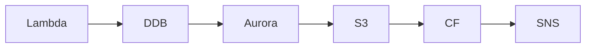

# InfraTales | AWS CDK Freelancer Marketplace: Dual Cognito User Pools, DynamoDB Messaging, and Step Functions Payments

**AWS CDK TYPESCRIPT reference architecture — platform pillar | advanced level**

> You're building a two-sided marketplace where freelancers and clients have completely different identity shapes, payment flows hit webhooks that occasionally vanish into the void, and your message query latency starts creeping past 200ms once inbox GSIs get hot. The standard single-user-pool Cognito setup breaks immediately when a freelancer also wants to post jobs as a client. Someone has to design this from scratch before the first invoice goes missing.

[](LICENSE)
[](CONTRIBUTING.md)
[](https://aws.amazon.com/)
[](https://aws.amazon.com/cdk/)
[](https://infratales.com/p/40b8c866-7bbf-48fb-a4ce-3abe7ad23ea4/)
[](https://infratales.com)


## 📋 Table of Contents

- [Overview](#-overview)
- [Architecture](#-architecture)
- [Key Design Decisions](#-key-design-decisions)
- [Getting Started](#-getting-started)
- [Deployment](#-deployment)
- [Docs](#-docs)
- [Full Guide](#-full-guide-on-infratales)
- [License](#-license)

---

## 🎯 Overview

The stack deploys a VPC (10.36.0.0/16, multi-AZ) fronting an ECS Fargate cluster behind an ALB, with Aurora MySQL handling transactional data (profiles, bids, milestones) and DynamoDB holding real-time messages behind a two-GSI access pattern (conversationId PK + timestamp SK, plus userId and receiverId GSIs for inbox queries) [from-code]. Two separate Cognito User Pools split freelancer and client identities with custom attributes per role [from-code]. A Node.js Lambda handles payment webhooks with a DLQ and VPC attachment [from-code], while Step Functions orchestrates the full project lifecycle from BiddingOpen through PaymentProcessed, integrating Lambda, SES, and SNS at state transitions [from-code]. CloudFront sits in front of S3 portfolio storage via OAI [from-code], and the entire stack is environment-parameterized through CDK context with consistent resource prefix tagging [from-code].

**Pillar:** PLATFORM — part of the [InfraTales AWS Reference Architecture series](https://infratales.com).
**Target audience:** advanced cloud and DevOps engineers building production AWS infrastructure.

---

## 🏗️ Architecture



> 📐 See [`diagrams/`](diagrams/) for full architecture, sequence, and data flow diagrams.

> Architecture diagrams in [`diagrams/`](diagrams/) show the full service topology (architecture, sequence, and data flow).
> The [`docs/architecture.md`](docs/architecture.md) file covers component responsibilities and data flow.

---

## 🔑 Key Design Decisions

- Two Cognito User Pools give clean role separation and independent custom attribute schemas, but every cross-pool operation (a freelancer acting as a client) requires token exchange logic or a separate identity linking layer — adds ~2 weeks of auth middleware work [inferred]
- Aurora MySQL in multi-AZ with read replicas costs roughly $400-600/month in dev if you forget to size down instance class; a single Aurora Serverless v2 cluster with auto-pause would cut dev costs by ~70% but adds cold-start latency on first query after idle [inferred]
- DynamoDB on-demand billing absorbs traffic spikes cleanly but at 8,000 active users with frequent messaging, provisioned capacity with auto-scaling typically runs 30-40% cheaper once traffic patterns stabilize [editorial]
- NAT Gateway count is correctly env-gated (1 for dev, 2 for prod), but a single NAT Gateway in dev means all private subnet egress flows through one AZ — Lambda VPC cold starts will occasionally time out if that AZ has issues [from-code]
- Step Functions Standard workflow logs every state transition and charges per state transition (~$0.025/1000); at scale with frequent milestone approvals across thousands of concurrent projects, Express Workflows would reduce orchestration cost by 10x [editorial]

> For the full reasoning behind each decision — cost models, alternatives considered, and what breaks at scale — see the **[Full Guide on InfraTales](https://infratales.com/p/40b8c866-7bbf-48fb-a4ce-3abe7ad23ea4/)**.

---

## 🚀 Getting Started

### Prerequisites

```bash
node >= 18
npm >= 9
aws-cdk >= 2.x
AWS CLI configured with appropriate permissions
```

### Install

```bash
git clone https://github.com/InfraTales/<repo-name>.git
cd <repo-name>
npm install
```

### Bootstrap (first time per account/region)

```bash
cdk bootstrap aws://YOUR_ACCOUNT_ID/YOUR_REGION
```

---

## 📦 Deployment

```bash
# Review what will be created
cdk diff --context env=dev

# Deploy to dev
cdk deploy --context env=dev

# Deploy to production (requires broadening approval)
cdk deploy --context env=prod --require-approval broadening
```

> ⚠️ Always run `cdk diff` before deploying to production. Review all IAM and security group changes.

---

## 📂 Docs

| Document | Description |
|---|---|
| [Architecture](docs/architecture.md) | System design, component responsibilities, data flow |
| [Runbook](docs/runbook.md) | Operational runbook for on-call engineers |
| [Cost Model](docs/cost.md) | Cost breakdown by component and environment (₹) |
| [Security](docs/security.md) | Security controls, IAM boundaries, compliance notes |
| [Troubleshooting](docs/troubleshooting.md) | Common issues and fixes |

---

## 📖 Full Guide on InfraTales

This repo contains **sanitized reference code**. The full production guide covers:

- Complete AWS CDK TYPESCRIPT stack walkthrough with annotated code
- Step-by-step deployment sequence with validation checkpoints
- Edge cases and failure modes — what breaks in production and why
- Cost breakdown by component and environment
- Alternatives considered and the exact reasons they were ruled out
- Post-deploy validation checklist

**→ [Read the Full Production Guide on InfraTales](https://infratales.com/p/40b8c866-7bbf-48fb-a4ce-3abe7ad23ea4/)**

---

## 🤝 Contributing

See [CONTRIBUTING.md](CONTRIBUTING.md) for guidelines. Issues and PRs welcome.

## 🔒 Security

See [SECURITY.md](SECURITY.md) for our security policy and how to report vulnerabilities responsibly.

## 📄 License

See [LICENSE](LICENSE) for terms. Source code is provided for reference and learning.

---

<p align="center">
  Built by <a href="https://infratales.com">InfraTales</a> — Production AWS Architecture for Engineers Who Build Real Systems
</p>
